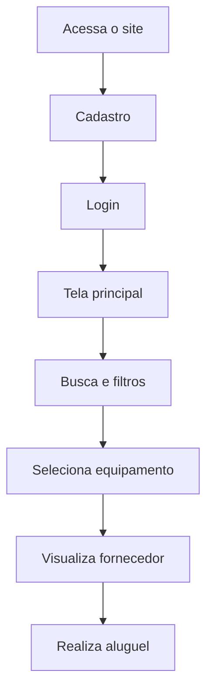
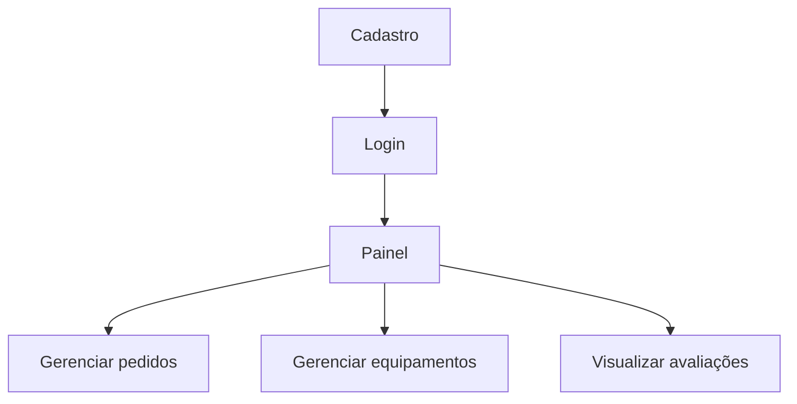

# 📦 Plataforma de Aluguel de Equipamentos

## 📖 Sobre o Projeto

A **Plataforma de Aluguel de Equipamentos** é uma aplicação web que conecta clientes (Pessoa Física ou Jurídica) a fornecedores de equipamentos, permitindo a locação de forma prática, segura e econômica.

A proposta é possibilitar que usuários encontrem equipamentos necessários para tarefas específicas sem precisar comprá-los, reduzindo custos e evitando problemas com armazenamento e manutenção.

---

## 🎯 Objetivos

* Facilitar o acesso a equipamentos sob demanda
* Conectar clientes a múltiplos fornecedores
* Garantir transparência em preços, avaliações e disponibilidade
* Simplificar o processo de locação

---

## 🚀 Funcionalidades

### 🔍 Clientes

* Buscar equipamentos disponíveis
* Filtrar por categoria, preço e avaliação
* Visualizar fornecedores e suas avaliações
* Consultar:

  * 📅 Disponibilidade por data
  * 💰 Valor da diária
  * 📊 Custos adicionais (impostos, franquias, etc.)
* Selecionar fornecedor e equipamento
* Visualizar dados do fornecedor:

  * 📞 Telefone
  * 📍 Endereço
  * 📄 Relatórios de revisão periódica *(sujeito à validação legal)*
  * 💬 Comentários de clientes *(se viável)*

---

### 🏢 Fornecedores

* Cadastro e autenticação
* Painel de controle com:

  * 📥 Pedidos pendentes
  * 🚚 Pedidos entregues
  * ⏳ Equipamentos em uso
  * ✅ Equipamentos devolvidos
* Filtro de pedidos por período

#### ⚙️ Gestão de Equipamentos

* Adicionar/remover equipamentos
* Atualizar informações
* Anexar:

  * 📄 Relatórios de revisão periódica
  * 🛡️ Apólices de seguro (se aplicável)

#### ⭐ Avaliações

* Visualizar feedbacks de clientes

---

## 🔄 Fluxo do Sistema

### 👤 Cliente

### 🏢 Fornecedor

---

## 💳 Pagamentos

* Integração futura com API de pagamento:

  * Mercado Pago *(planejado)*

---

## 💡 Diferenciais

* ⭐ Sistema de avaliação de fornecedores
* 📊 Transparência de preços e disponibilidade
* 💼 Modelo de destaque premium para fornecedores
* 🌐 Centralização de múltiplos fornecedores

---

## ⚠️ Considerações

* Validar legalmente a exibição de relatórios técnicos
* Avaliar sistema de comentários de clientes
* Garantir segurança na autenticação e pagamentos

---

## 🛠️ Tecnologias (Sugestão)

* Frontend: 
* Backend: 
* Banco de Dados: 
* Pagamentos: Mercado Pago API

---

## 📌 Roadmap

* [ ] Cadastro e autenticação
* [ ] Sistema de busca e filtros
* [ ] Cadastro de fornecedores
* [ ] Sistema de avaliações
* [ ] Integração com pagamento
* [ ] Deploy da aplicação

